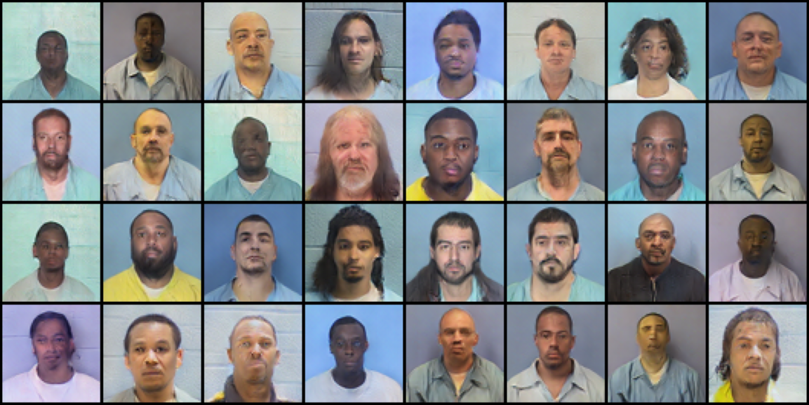

# Generating faces using GANs

This is a school project where two types of Generative Adversarial Networks were used to generate images. We also trained a variational autoencoder. The dataset used to train the GANs was one of mugshots (https://www.kaggle.com/datasets/elliotp/idoc-mugshots). The best results were obtained from the DCGAN, and the images were surprisingly human:

